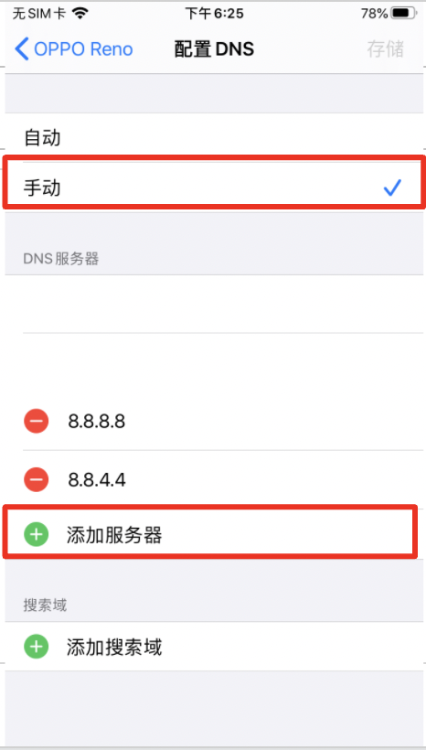

# IOS

### 苹果手机DNS设定

1. 设置→ Wi-Fi
    
    - 
    
2. Wi-Fi → 点击红框
    
    - 
    
3. 点击 DNS →配置DNS
    
    - 
    
4. 配置DNS→选择「手动」→ 点击「添加服务器」
    
    - 
    
5. 分别加入 DNS 8.8.8.8 和 114.114.114.114 两组確認後存储
    
    - 
    
6. 设定后再请重新连线上Wifi即可
