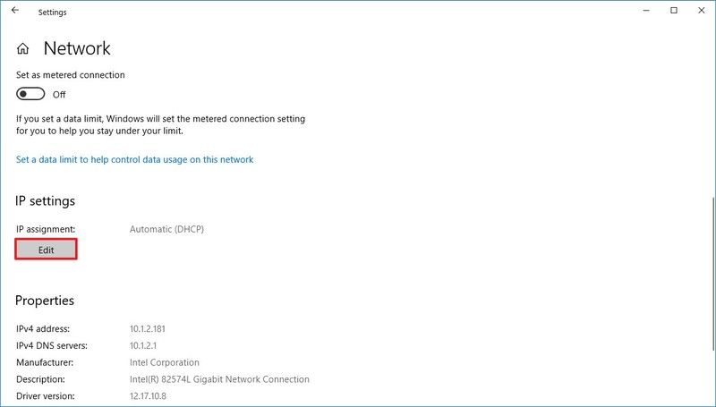

# Windows

## Windows7

1. 点击电脑右下角任务栏的"网络"图标，在弹出的界面点击"打开网络和共享中心"
    
    - 
    
2. 在打开的新窗口后，点击正在联网的网络连接
    
    - 
    
3. 在打开的网络连接状态界面，左下角有一个属性按钮，找到后然后点击"属性"
    
    - 
    
4. 在属性窗口中选中“Internet 协议版本 4 (TCP/IPv4)”，如果是IPv6网络，则选择“Internet 协议版本 6（TCP/IPv6）”，点击“属性”。
    
    - 
    
5. 在弹出的属性窗口中，设置DNS为指定DNS服务器地址即可，请将DNS1更改为**8.8.8.8** DNS2更改为**114.114.114.114**。
    
    - 
    
6. 修改确认后,请重新开机即可
    - 或是手动删除DNS缓存
        1. 由于我们系统本地一般都有 dns 缓存，所以可能你设定完后没有马上生效。
            
            使用快捷键 win+r，然后在弹出的窗口输入cmd，鼠标右键使用管理员身份运行。
            或者在开始菜单搜索栏输入cmd.exe，鼠标右键使用管理员身份运行
            
            - 
            
        2. 在命令行窗口中输入**ipconfig /flushdns**并回车，即可清除DNS缓存。
            
            - 
            

## Windows 10

1. 打开 「**设置**」—> 点击 「**网络与互联网**」 —>点击 「**以太网**」 （或者 无线上网 取决于您的连接）—>选择「**将 Windows 10 连接到网络的连接**」
    
    - 
    
2. 在**「IP 设置」**部分下，单击 编辑 按钮。
    
    - 
    
3. 使用“编辑 IP 设置”下拉菜单并选择 **手册** 选项。
4. 打开 **IPv4 切换** 转变。
5. **确认您的“首选 DNS:8.8.8.8”和“备用 DNS:8.8.4.4”地址。**
    
    - 
    
6. 修改确认后,请重新开机即可
