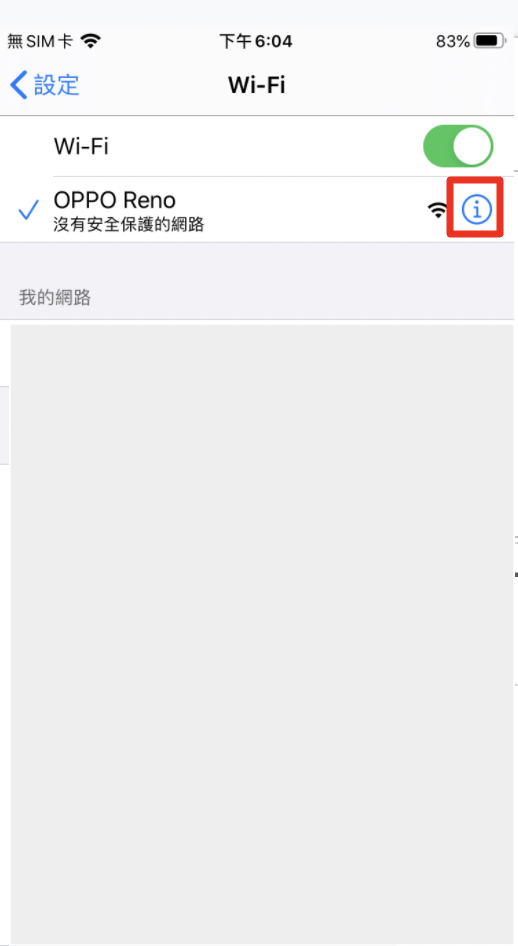
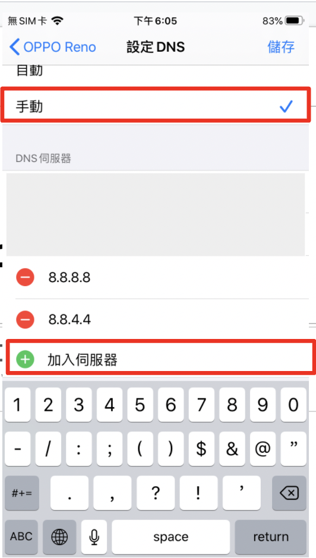
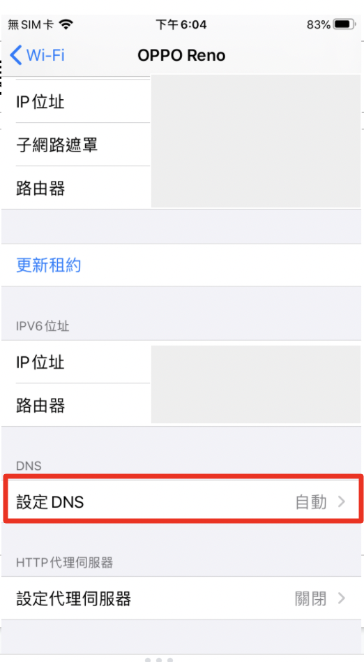

# 安卓

### 设定公共DNS

1. 手机设定 → Wifi → 找到目前使用的WiFi并点击红框
    
    - 
    
2. 点击 【设定DNS】
    
    - 
    
3. 选择「手动」→ 点击「加入伺服器」分别加入 DNS 8.8.8.8 和 114.114.114.114 两组
    
    - 
    

### 设定私人DNS

- 可用**的 DNS over TLS 提供商**
    
    
    | Google | dns.google |
    | --- | --- |
    | Cloudflare | 1dot1dot1dot1.cloudflare-dns.com |
    | Quad9 | dns.quad9.net |
    | CleanBrowsing | security-filter-dns.cleanbrowsing.org |
    | DNS | dns.rubyfish.cn |
1. 打开 **[设置] → [WLAN 和互联网] → [私人 DNS] → [私人 DNS 提供商主机名称]** 
2. 输入 **DNS over TLS 提供商主机名 → 保存。**
    
    
    
3. 保存以后**，如果私人 DNS 下方显示主机名代表配置成功。**
    
    
    
4. 验证是否生效
    
    **可以访问 [https://ping.huatuo.qq.com/](https://ping.huatuo.qq.com/) 查看IP信息的部份DNS有没有改成修改后的主机名称**
    
    
